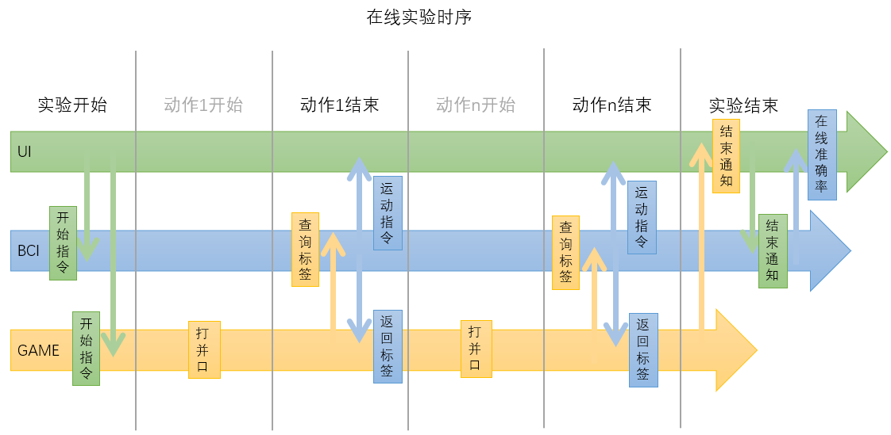

# BCI 通信报文

- [BCI 通信报文](#bci-%e9%80%9a%e4%bf%a1%e6%8a%a5%e6%96%87)
  - [角色](#%e8%a7%92%e8%89%b2)
  - [通信方式](#%e9%80%9a%e4%bf%a1%e6%96%b9%e5%bc%8f)
  - [通信时序](#%e9%80%9a%e4%bf%a1%e6%97%b6%e5%ba%8f)
  - [通信表](#%e9%80%9a%e4%bf%a1%e8%a1%a8)
  - [发送包](#%e5%8f%91%e9%80%81%e5%8c%85)
    - [心跳包](#%e5%bf%83%e8%b7%b3%e5%8c%85)
    - [开始离线采集包](#%e5%bc%80%e5%a7%8b%e7%a6%bb%e7%ba%bf%e9%87%87%e9%9b%86%e5%8c%85)
    - [结束离线采集包](#%e7%bb%93%e6%9d%9f%e7%a6%bb%e7%ba%bf%e9%87%87%e9%9b%86%e5%8c%85)
    - [建模包](#%e5%bb%ba%e6%a8%a1%e5%8c%85)
    - [模型准确率包](#%e6%a8%a1%e5%9e%8b%e5%87%86%e7%a1%ae%e7%8e%87%e5%8c%85)
    - [开始在线采集包](#%e5%bc%80%e5%a7%8b%e5%9c%a8%e7%ba%bf%e9%87%87%e9%9b%86%e5%8c%85)
    - [结束在线采集包](#%e7%bb%93%e6%9d%9f%e5%9c%a8%e7%ba%bf%e9%87%87%e9%9b%86%e5%8c%85)
    - [在线准确率包](#%e5%9c%a8%e7%ba%bf%e5%87%86%e7%a1%ae%e7%8e%87%e5%8c%85)
    - [查询包](#%e6%9f%a5%e8%af%a2%e5%8c%85)
    - [查询结果包](#%e6%9f%a5%e8%af%a2%e7%bb%93%e6%9e%9c%e5%8c%85)
  - [回复包](#%e5%9b%9e%e5%a4%8d%e5%8c%85)
    - [回复心跳包](#%e5%9b%9e%e5%a4%8d%e5%bf%83%e8%b7%b3%e5%8c%85)
    - [回复能够被正确识别的包](#%e5%9b%9e%e5%a4%8d%e8%83%bd%e5%a4%9f%e8%a2%ab%e6%ad%a3%e7%a1%ae%e8%af%86%e5%88%ab%e7%9a%84%e5%8c%85)
    - [回复无法被正确识别的包](#%e5%9b%9e%e5%a4%8d%e6%97%a0%e6%b3%95%e8%a2%ab%e6%ad%a3%e7%a1%ae%e8%af%86%e5%88%ab%e7%9a%84%e5%8c%85)
  - [运行时错误包](#%e8%bf%90%e8%a1%8c%e6%97%b6%e9%94%99%e8%af%af%e5%8c%85)
    - [状态错误](#%e7%8a%b6%e6%80%81%e9%94%99%e8%af%af)
    - [文件错误](#%e6%96%87%e4%bb%b6%e9%94%99%e8%af%af)
    - [资源忙错误](#%e8%b5%84%e6%ba%90%e5%bf%99%e9%94%99%e8%af%af)
    - [未定义错误](#%e6%9c%aa%e5%ae%9a%e4%b9%89%e9%94%99%e8%af%af)

## 角色

| 简称  | 角色         |
| ----- | ------------ |
| BCI   | 脑机交互软件 |
| UI    | 用户界面软件 |
| GAMER | 游戏软件     |

## 通信方式

- 采用 TCP 报文的形式进行通信。
- BCI 按约定的 _IP 地址_ 和 _端口号_ 建立 TCP 服务器。
- UI 和 GAMER 采用长连接的方式与 BCI 进行通信。

## 通信时序


<br/>


## 通信表

| 模式 | 通信方向     | 发送包                                                       |
| ---- | ------------ | ------------------------------------------------------------ |
| 离线 | UI -> BCI    | 心跳包，开始离线采集包，结束离线采集包，建模包               |
| 离线 | BCI -> UI    | 心跳包，模型准确率包，运行时错误包                           |
| 在线 | UI -> BCI    | 心跳包，开始在线采集包，结束在线采集包                       |
| 在线 | BCI -> UI    | 心跳包，运行时错误包，在线准确率包（仅在在线实验结束后发送） |
| 在线 | GAMER -> BCI | 心跳包，查询包                                               |
| 在线 | BCI -> GAMER | 心跳包，查询结果包，运行时错误包                             |

所有通信包分为*发送包*、*回复包*和*运行时错误包*三类。  
收到[发送包](#发送包)或[运行时错误包](#运行时错误包)应立即回复[回复包](#回复包)；  
收到[回复包](#回复包)无需回复。

典型通信过程：

心跳包

1. A -> B 心跳包
2. B -> A 回复心跳包  
   (其中，A、B 为任意角色)

离线游戏中，UI 要求 BCI 开始采集

1. UI -> BCI 开始离线采集包
2. BCI -> UI 回复包

离线游戏中，UI 要求 BCI 进行建模

1. UI -> BCI 建模包
2. BCI -> UI 回复包
3. BCI -> UI 模型准确率包
4. UI -> BCI 回复包

在线游戏中，GAMER 要求 BCI 估计标签

1. GAMER -> BCI 查询包
2. BCI -> GAMER 回复包
3. BCI -> GAMER 查询结果包
4. GAMER -> BCI 回复包

BCI 向其他人发送运行时错误

1. BCI -> Other 运行时错误包
2. Other -> BCI 回复包  
   (其中，Other 为 Gamer 或 UI)

## 发送包

### 心跳包

所有通信参与者都可以定期发送心跳包。

```json
{
  "mode": "keepalive",
  "timestamp": "1585297645.123"
}
```

### 开始离线采集包

```json
{
  "mode": "Offline",
  "cmd": "kaishicaiji",
  "shujumulu": "\\", // 数据目录，离线数据将存在这里
  "timestamp": "1585297645.123"
}
```

### 结束离线采集包

```json
{
  "mode": "Offline",
  "cmd": "jieshucaiji",
  "timestamp": "1585297645.123"
}
```

### 建模包

```json
{
  "mode": "Offline",
  "cmd": "jianmo",
  "shujumulu": "\\", // 数据目录，请确保目录里只包含离线数据
  "moxingmulu": "\\", // 模型目录，训练出的模型会存在这里
  "timestamp": "1585297645.123"
}
```

### 模型准确率包

```json
{
  "mode": "Offline",
  "cmd": "zhunquelv",
  "moxinglujing": "\\", // 模型路径
  "shujulujing": "\\", // 数据路径，后面的准确率是根据该模型和数据计算出来的
  "zhunquelv": "0.95", // 准确率
  "timestamp": "1585297645.123"
}
```

---

### 开始在线采集包

```json
{
  "mode": "Online",
  "cmd": "kaishicaiji",
  "moxinglujing": "\\", // 模型路径，请确保该路径指向模型文件
  "timestamp": "1585297645.123"
}
```

### 结束在线采集包

```json
{
  "mode": "Online",
  "cmd": "jieshucaiji",
  "timestamp": "1585297645.123"
}
```

### 在线准确率包

```json
{
  "mode": "Online",
  "cmd": "zhunquelv",
  "moxinglujing": "\\", // 模型路径，后面的准确率是根据该模型和在线数据计算出来的
  "zhunquelv": "0.85", // 准确率
  "timestamp": "1585297645.123"
}
```

---

### 查询包

```json
{
  "mode": "Query",
  "chixushijian": "3.0", // 上一个动作持续了多长时间，单位为秒，3.0是例子
  "zhenshibiaoqian": "1", // 上一个动作的真实标签，1是例子
  "timestamp": "1585297645.123"
}
```

### 查询结果包

```json
{
  "mode": "QueryReply",
  "gujibiaoqian": "1", // 上一个动作的预测标签，1是例子
  "timestamp": "1585297645.123"
}
```

## 回复包

### 回复心跳包

```json
{
  "mode": "Reply",
  "state": "keepalive",
  "timestamp": "1585297645.123"
}
```

### 回复能够被正确识别的包

代表开始执行所需操作。

```json
{
  "mode": "Reply",
  "state": "OK",
  "timestamp": "1585297645.123"
}
```

### 回复无法被正确识别的包

代表无法执行任何操作。

```json
{
  "mode": "Reply",
  "state": "ParseError",
  "timestamp": "1585297645.123"
}
```

## 运行时错误包

代表执行时遇到错误。  
在 detail 字段中，应含有简要描述。

### 状态错误

代表运行状态错误，包括但不限于：

- 重复开始采集
- 重复停止采集
- 实验过程中要求建模
- 离线实验过程中要求查询标签
- 在线实验未开始时要求查询标签

```json
{
  "mode": "RuntimeError",
  "type": "StateError",
  "detail": "xxxx",
  "timestamp": "1585297645.123"
}
```

### 文件错误

代表目标文件无法获取，如无法找到、无法读取等。

```json
{
  "mode": "RuntimeError",
  "type": "FileError",
  "detail": "xxxx",
  "timestamp": "1585297645.123"
}
```

### 资源忙错误

代表后台资源忙，操作无法运行。

```json
{
  "mode": "RuntimeError",
  "type": "BusyError",
  "detail": "xxxx",
  "timestamp": "1585297645.123"
}
```

### 未定义错误

代表无法事先定义，但运行时发生的错误，如内存满、关键设备断开等。

```json
{
  "mode": "RuntimeError",
  "type": "UnknownError",
  "detail": "xxxx",
  "timestamp": "1585297645.123"
}
```
