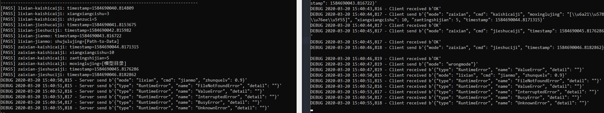

# Protocol of Interface between UI and Controller

E-mail: listenzcc@mail.bnu.edu.cn

- [Protocol of Interface between UI and Controller](#protocol-of-interface-between-ui-and-controller)
  - [Definition](#definition)
  - [Communication](#communication)
  - [Socket Format](#socket-format)
  - [Responses](#responses)
  - [Runtime Errors](#runtime-errors)
  - [Example code](#example-code)
    - [Run demo test](#run-demo-test)
    - [Run UI test](#run-ui-test)

## Definition

UI: The User Interface software, who send TCP socket to TCP Server.

Controller: The backend workload controller, who maintain TCP Server.

IP and PORT: The IP address and PORT number of TCP Server.

## Communication

UI and Controller communicate through TCP socket.
The process is:

- Controller starts a TCP Server, listening at _IP:PORT_.
- The UI send TCP socket to TCP Server as [_Socket Format_](#socket-format).
- The TCP Server will reply OKResponse or UnknownResponse when receives a json package.

## Socket Format

Socket content should be in bytes (UTF-8 encoding), using JSON format.

A legal socket content is something like

b'{mode="lixian", cmd="kaishicaiji", xiangxiangcishu=3, shiyanzuci=5, timestamp=1584664654.5274417}'

```python
# Setup dict
content = dict(
        mode="lixian",
        cmd="kaishicaiji",
        xiangxiangcishu=3,
        shiyanzuci=5,
        dongzuoleixing=2,
        timestamp=time.time()
    )

# Dump dict into JSON and encode
bytes = json.dumps(content).encode()

# Send bytes
# See client.py for detail
```

All required socket content are in following table:

From client to server

| Mode    | Command     | Description   | Parameters                                                                                       |
| ------- | ----------- | ------------- | ------------------------------------------------------------------------------------------------ |
| lixian  | kaishicaiji | 离线-开始采集 | timestamp: 时间戳; xiangxiangcishu: 想象次数; shiyanzuci: 实验组次; dongzuoleixing: 动作类型     |
| lixian  | jieshucaiji | 离线-结束采集 | timestamp: 时间戳                                                                                |
| lixian  | jieshuciji  | 离线-结束刺激 | timestamp: 时间戳                                                                                |
| lixian  | jianmo      | 离线-建模     | timestamp: 时间戳; shujulujing: 数据路径                                                         |
| zaixian | kaishicaiji | 在线-开始采集 | timestamp: 时间戳; xiangxiangcishu: 想象次数; zantingshijian: 暂停时间; dongzuoleixing: 动作类型 |
| zaixian | jieshucaiji | 在线-结束采集 | timestamp: 时间戳                                                                                |
| zaixian | jieshuciji  | 在线-结束刺激 | timestamp: 时间戳                                                                                |

From server to client

| Mode   | Command | Description | Parameters                                                   |
| ------ | ------- | ----------- | ------------------------------------------------------------ |
| lixian | jianmo  | 离线-建模   | timestamp: 时间戳; zhunquelv: 准确率; moxinglujing: 模型路径 |

A legal socket content should contain mode as Mode, cmd as Command and para as Parameters as required.
No more, No less.

## Responses

Once received a socket package, client or server should response a JSON package immediately, the format is as following

| Type | State | [Meaning]                      | Parameters                                  |
| ---- | ----- | ------------------------------ | ------------------------------------------- |
| Resp | OK    | The request is legal.          | repeat: 重复接收到的内容; timestamp: 时间戳 |
| Resp | FAIL  | The request can not be parsed. | repeat: 重复接收到的内容; timestamp: 时间戳 |

Example code:

```python
OKResponse = dict(
    type='Resp',
    state='OK',
    repeat='', # Repeat what has been received.
    timestamp=time.time()
)
FailResponse = dict(
    type='Resp',
    state='FAIL',
    repeat='', # Repeat what has been received.
    timestamp=time.time(),
)
```

## Runtime Errors

We defined Runtime Errors as following

| Type         | Name              | [Meaning]                                     | Parameters                          |
| ------------ | ----------------- | --------------------------------------------- | ----------------------------------- |
| RuntimeError | FileNotFoundError | File not found on given path                  | detail: 简要描述; timestamp: 时间戳 |
| RuntimeError | ValueError        | Incoming value can not be correctly parsed    | detail: 简要描述; timestamp: 时间戳 |
| RuntimeError | InterruptedError  | Operation being interrupted                   | detail: 简要描述; timestamp: 时间戳 |
| RuntimeError | BusyError         | Operation failed because the resource is busy | detail: 简要描述; timestamp: 时间戳 |
| RuntimeError | UnknownError      | For errors that are not defined               | detail: 简要描述; timestamp: 时间戳 |

Example code:

```python
FileNotFoundError = dict(
    type='RuntimeError',
    name='FileNotFoundError',
    detail='Can not found legal data files in {path}.'.format(path='[path]'),
    timestamp=time.time(),
)

BusyError = dict(
    type='RuntimeError',
    name='BusyError',
    detail='The backend computing resources is busy. Module training failed.',
    timestamp=time.time(),
)
```

The details of Runtime Errors can be found in [profile](./profile.py)

## Example code

The example codes in python are provided: [TCP Server](./server.py), [UI Sender](./client.py).

IP and PORT are set up in [Profile](./profile.py).

### Run demo test

Run python scripts as following:

- Setup IP and PORT in [Profile file](./profile.py)
- Start TCP Server by run _TCP Server_
- Run _UI Sender_ to simulate socket communication
- You may see output of _TCP Server_ like following, means Server has received all the information it will need in the project.
- The server will send accuracy to client for test.
- The server will send Runtime Errors for test.

  ```ruby
  [PASS] lixian-kaishicaiji: xiangxiangcishu=3
  [PASS] lixian-kaishicaiji: shiyanzuci=5
  [PASS] lixian-kaishicaiji: timestamp=1584663654.5134408
  [PASS] lixian-jieshucaiji: timestamp=1584663654.5274417
  [PASS] lixian-jieshuciji: timestamp=1584663654.5384455
  [PASS] lixian-jianmo: shujulujing=[Path-to-Data]
  [PASS] lixian-jianmo: timestamp=1584663654.5464418
  [PASS] zaixian-kaishicaiji: xiangxiangcishu=10
  [PASS] zaixian-kaishicaiji: zantingshijian=5
  [PASS] zaixian-kaishicaiji: moxinglujing=[模型目录]
  [PASS] zaixian-kaishicaiji: timestamp=1584663654.5604415
  [PASS] zaixian-jieshucaiji: timestamp=1584663654.5754406
  [PASS] zaixian-jieshuciji: timestamp=1584663654.591445
  ```



### Run UI test

If you want to test your UI for TCP communication, you have to start _TCP Server_ first.

- Setup IP and PORT in [Profile file](./profile.py)
- Start TCP Server by run _TCP Server_
- Let UI send TCP socket
- The output of _TCP Server_ should report if the received sockets are correct.
